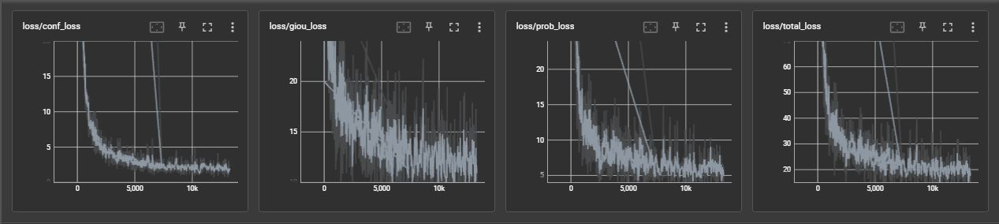
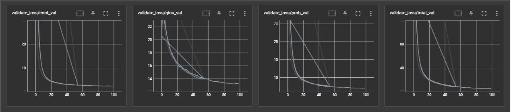
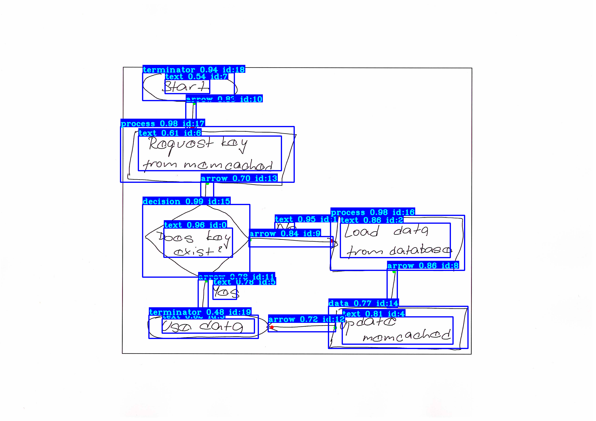
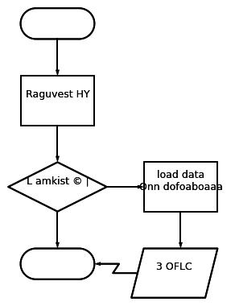

# Hand-drawn Flowchart Recognition
## Team Members:
- Mu Chen, MS-SE (mu.chen@sjsu.edu) [SJSU ID: 014725425]
- Roger Kuo, MS-SE (roger.kuo@sjsu.edu) [SJSU ID: 013784706]
- Hardy Leung, MS-AI (kwok-shing.leung@sjsu.edu) [SJSU ID: 016711877] COORDINATOR
- Jasmine Wang, MS-AI (jasmine.wang@sjsu.edu) [SJSU ID: 002805362]

[Proposal](./report/proposal.pdf)

[Report](./report/report.pdf)

Additional packages:
- Tesseract:
    - via Anaconda ```$ conda install -c conda-forge tesseract```
    - (Optional alternative for MacOS users): ```$ brew install tesseract```
- Other:
    - ```$ pip install pytesseract```
    - ```$ pip install opencv-contrib-python```
    - ```$ pip install schemdraw[matplotlib]```

## Dataset

- [Dataset](https://cmp.felk.cvut.cz/~breslmar/flowcharts_offline/)
- [Dataset Preparation](https://docs.google.com/document/d/1iY2F0LpL9rOEVAxZMaGc8gkD9l-GDl9_IjW8bnVCrqw/edit?usp=sharing)

## Literature Review

- [Symbol detection in online handwritten graphics using Faster R-CNN](https://arxiv.org/pdf/1712.04833.pdf)
- [Arrow R-CNN for handwritten diagram recognition](https://www.researchgate.net/publication/348974392_Arrow_R-CNN_for_handwritten_diagram_recognition)
- [DrawnNet: Offline Hand-Drawn Diagram Recognition Based on Keypoint Prediction of Aggregating Geometric Characteristics](https://www.ncbi.nlm.nih.gov/pmc/articles/PMC8947756/pdf/entropy-24-00425.pdf)

---
## Instructions

How to setup and use the program:
1. Install Anaconda
2. Use the provided yaml file to create a conda environment 
    1. ```$ conda env create -f conda-cpu.yml```
    2. You can modify the yaml file to use a different environment name
3. Activate the environment 
    1. ```$ conda activate <insert_env_name>```
5. Install the additional packages listed above in the "Software" section
6. Run the detection script 
    1. ```$ python detection_custom.py```
    2. You can also add and use your own hand-drawn flowchart image to the main directory
    3. ```$ python detection_custom.py <insert_path_to_image>```

How to train a custom dataset:
- You can search through the [source repo](https://github.com/pythonlessons/TensorFlow-2.x-YOLOv3)
- Or look through their [main website](https://pylessons.com/)

---
## Model Evaluation

Enter in the terminal ```$ tensorboard --logdir=log``` and then navigate to http://localhost:6006/
### Training Loss


### Validation Loss


## Flowchart Recognition and Generation

### Sample Classification


### Flowchart Generation


### Demonstration

